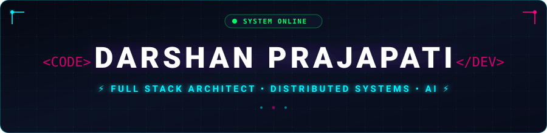

  <!-- ==================== HEADER BANNER ==================== -->
  

  <!-- ==================== DYNAMIC TYPING SVG ==================== -->
  

    
  

  <!-- ==================== ANIMATED NEON DIVIDER ==================== -->
  

    

  <!-- ==================== QUICK STATUS BADGES ==================== -->
  

    
    
    
  

  <!-- ==================== SOCIAL LINKS ==================== -->
  

    
    
    
    
  

 

<!-- ==================== ABOUT ME ==================== -->
## 🚀 About Me

- 💻 **Full Stack Software Engineer** specializing in resilient distributed backends, modern frontend ecosystems, and cloud systems.
- 🧠 **Currently Mastering:** Distributed Systems, Scalable Database Design, Event-Driven Architecture, and AI Engineering.
- 🛠️ **Engineering Focus:** Building high-concurrency, low-latency microservices and responsive web platforms using TypeScript, React, Next.js, Node.js, and Docker.
- 🎯 **Mission:** Designing production-ready software solutions that scale seamlessly to millions of users.
- ⚡ **Philosophy:** *"Write clean code, automate workflows, eliminate bottlenecks, and craft intuitive user experiences."*

 

<!-- ==================== CONTRIBUTION SNAKE ==================== -->
<h2 align="center">🎮 Contribution Activity</h2>

  <picture>
    <source media="(prefers-color-scheme: dark)" srcset="assets/github-contribution-grid-snake-dark.svg" />
    <source media="(prefers-color-scheme: light)" srcset="assets/github-contribution-grid-snake.svg" />
    
  </picture>

 

<!-- ==================== TECH STACK & SKILLS ==================== -->
<h2 align="center">🛠️ Skills & Technologies</h2>

  

 

### 💻 Tech Arsenal Breakdown

- **Languages:** `JavaScript (ES6+)`, `TypeScript`, `C`, `Java`, `SQL`, `HTML5`, `CSS3`
- **Frontend & UI:** `React.js`, `Next.js`, `Redux Toolkit`, `Tailwind CSS`, `Storybook`
- **Backend & APIs:** `Node.js`, `Express.js`, `Socket.io`, `RESTful APIs`, `WebSockets`, `JWT`
- **Databases & Caching:** `PostgreSQL`, `MongoDB`, `Redis`, `MySQL`
- **Cloud & DevOps:** `Amazon Web Services (AWS)`, `Docker`, `Linux`, `Git`, `GitHub Actions`
- **Testing & Tooling:** `Jest`, `VS Code`, `Postman`, `NPM`

 

<!-- ==================== GITHUB ANALYTICS ==================== -->
<h2 align="center">📊 GitHub Analytics</h2>

  
  

  
  

 

<!-- ==================== FEATURED SYSTEMS ==================== -->
## 💡 Engineering Focus & Highlights

| 🌐 Full Stack Architecture | ⚙️ Scalable Distributed Systems |
| :--- | :--- |
| **High-Performance Web Platforms** • Interactive UI engineered with **Next.js**, **React**, and **TypeScript** • Styled with modern utility-first **Tailwind CSS** • Client-side state orchestration via **Redux Toolkit** | **Resilient Backend & Data Services** • Microservices and APIs built with **Node.js** and **Express.js** • Ultra-fast caching layers powered by **Redis** • Real-time duplex communication via **WebSockets (Socket.io)** |
| **Database Design & Indexing** • Relational modeling with **PostgreSQL** and **MySQL** • Document stores with **MongoDB** • Query optimization and ACID-compliant transaction design | **DevOps & Cloud Native Deployment** • Containerization and multi-stage builds with **Docker** • Cloud infrastructure running on **AWS** and **Linux** • Continuous Integration pipelines via **GitHub Actions** |

 

<!-- ==================== DAILY INSPIRATION & VIBES ==================== -->
<h2 align="center">🎵 Daily Inspiration & Coding Vibes</h2>

  
  &nbsp;&nbsp;&nbsp;&nbsp;
  

 

<!-- ==================== FOOTER ==================== -->

  

  

    ⚡ <b>Crafted with passion, caffeine, and neon photons by <a href="https://github.com/Dazzling-Darshan">Darshan Prajapati</a></b> ⚡
  

  

    © 2026 Dazzling-Darshan • Open to Collaborations & Engineering Roles
  

